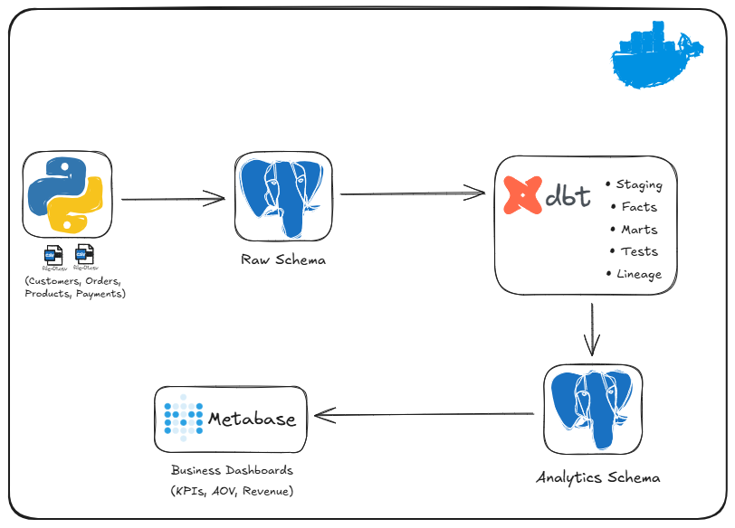
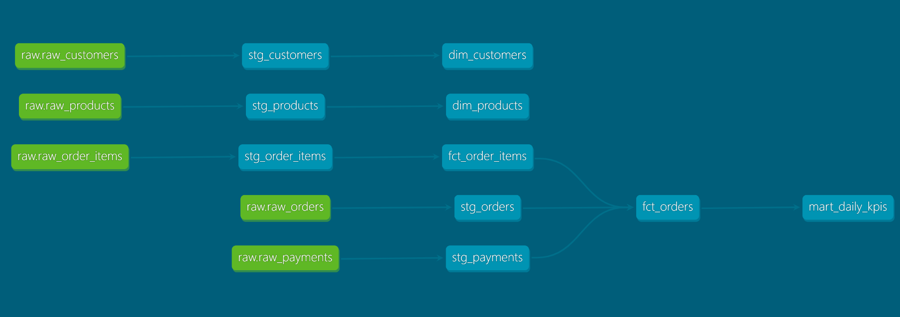
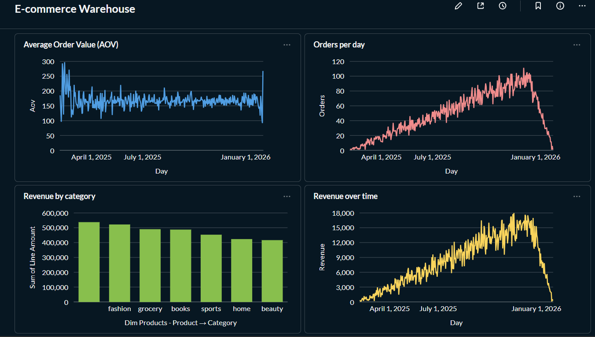
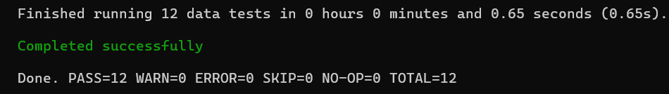

# E-commerce Analytics Warehouse (dbt Core)

## Overview
This project is an end-to-end **e-commerce analytics pipeline** built with open-source tools.  
It covers the full lifecycle from data ingestion to transformation, testing, documentation, and business dashboards.

---

## Architecture

**Flow:**
1. **Data Generation & Ingestion**
   - Synthetic e-commerce data generated with Python
   - Loaded into PostgreSQL (`raw` schema)

2. **Transformations (dbt Core)**
   - Staging models (`stg_*`) for cleaning and typing
   - Fact and dimension models (`fct_*`, `dim_*`)
   - Business mart (`mart_daily_kpis`)

3. **Data Quality & Documentation**
   - dbt tests (uniqueness, not null, relationships)
   - dbt docs with full lineage

4. **Analytics & Visualization**
   - Metabase dashboard for business KPIs

## Lineage & docs


## Analytics Dashboard

---

## Tech Stack
- **Python** – data generation & ingestion  
- **PostgreSQL** – analytics warehouse  
- **dbt Core** – transformations, tests, documentation  
- **Metabase** – BI dashboards  
- **Docker Compose** – local infrastructure  

---

## Data Model

### Raw layer (`raw`)
- `raw_customers`
- `raw_products`
- `raw_orders`
- `raw_order_items`
- `raw_payments`

### Staging layer (`stg_`)
- Type casting (`timestamptz`, numerics)
- Column standardization
- Analytics-ready views

### Analytics layer
- **Dimensions**
  - `dim_customers`
  - `dim_products`
- **Facts**
  - `fct_orders` (order grain)
  - `fct_order_items` (order-item grain)
- **Business mart**
  - `mart_daily_kpis` (revenue, orders, customers, AOV per day)

---

## Data Quality
Implemented with dbt tests:
- Primary key uniqueness
- Not-null constraints
- Referential integrity between facts and dimensions


All tests pass successfully.

---

## Dashboard
The Metabase dashboard includes:
- Revenue over time
- Orders per day
- Average Order Value (AOV)
- Revenue by product category

The dashboard is powered by `analytics.mart_daily_kpis` and fact/dimension models.

---

## How to Run Locally

### 1. Start services
```bash
docker compose up -d
```

### 2. Generate and load raw data
```bash
python ingest/generate_and_load.py
```

### 3. Run transformations and tests
```bash
dbt run
dbt test
```

### 4. Generate dbt documentation
```bash
dbt docs generate
dbt docs serve
```
Docs available at: http://localhost:8080

### 5. Open Metabase
- URL: http://localhost:3000
- Connect to Postgres host: `postgres`

---

## Key Learnings
- Designing fact tables at the correct grain
- Separating order-level and product-level analytics
- Applying dbt best practices (layering, tests, lineage)
- Building business-facing KPIs from raw data

---

## Future Improvements
- Automated ingestion (Airbyte)
- Metadata & lineage platform (OpenMetadata)
- Incremental models
- ML use case (customer churn or CLV)

---

## Author
**Walid Birouk**  
MSc Artificial Intelligence | Data & Analytics Engineering
